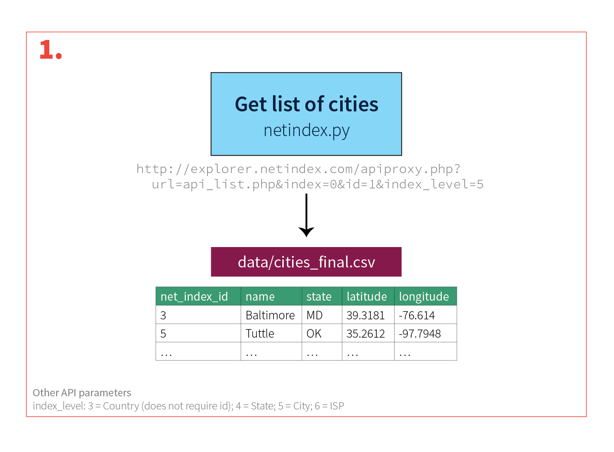
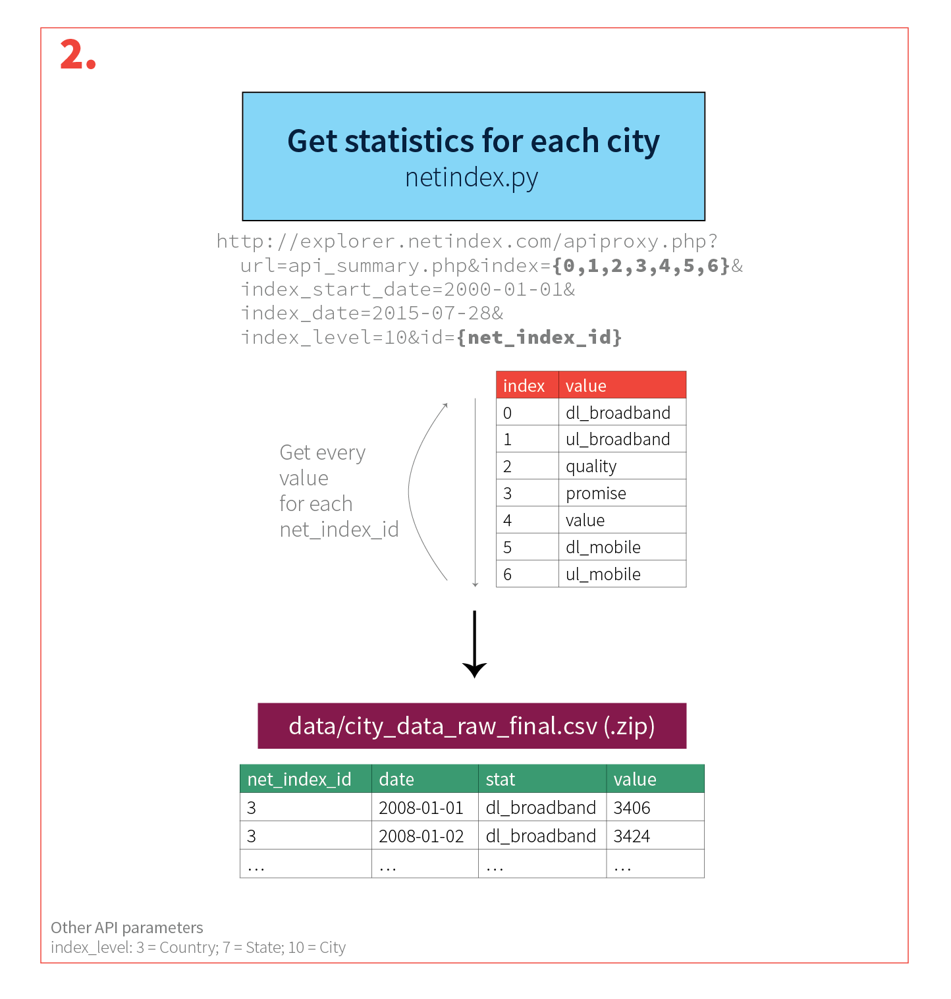
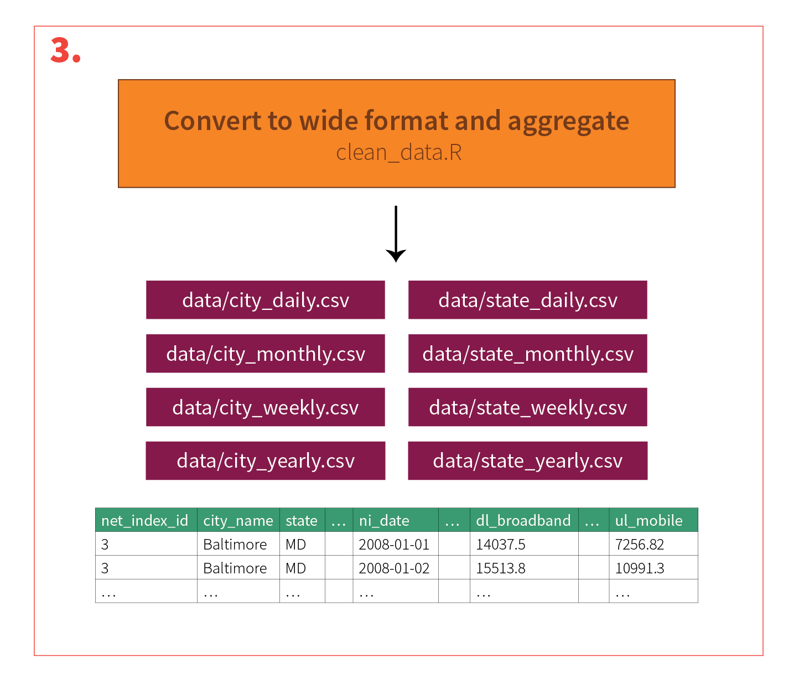

# Net Index Parser

Access the undocumented API for Ookla's fantastic [Net Index](http://www.netindex.com), convert the resulting JSON to CSV, and munge the resulting CSV with R.

## Installation

Because it can take a while to make all the necessary API calls (each city requires 7 individual API calls), it's best to run this script on a separate computer, preferrably a virtual machine in the cloud, like a [Digital Ocean server](https://www.digitalocean.com) or [Amazon EC2 instance](http://aws.amazon.com/ec2/). 

1. Install [Python 3](https://www.python.org) and [R 3](http://www.r-project.org) (script last tested with Python 3.4.3 and R 3.2.1)
    * Python
        * Ubuntu: Python 3 is preinstalled in Ubuntu 12.10 and above as `python3`
        * OS X: Install Python 3 using [Homebrew](http://brew.sh): `brew install python3`
    * R
        * Ubuntu: [Follow these instructions](https://cran.r-project.org/bin/linux/ubuntu/README)
        * OS X: Download the [convenient binary package installer](https://cran.rstudio.com/bin/macosx/)
2. Navigate to the project folder in a terminal: `cd /path/to/netindex/`
3. Install all Python packages: `pip3 install -r requirements.txt`
4. Install all R packages: `Rscript requirements.R`

## Usage

Run the following series of commands to 

1. Navigate to the project folder in a terminal: `cd /path/to/netindex/`
2. Run the Python script to loop through the API: `python3 netindex.py`
    * Run in background
    * Log
    * Wait for hours and hours
3. Run the R script to clean and process the raw long data: `Rscript clean_data.R`
4. All the generated CSVs will be in `data/*.csv`

The whole process is summarized in the flowcharts below:

